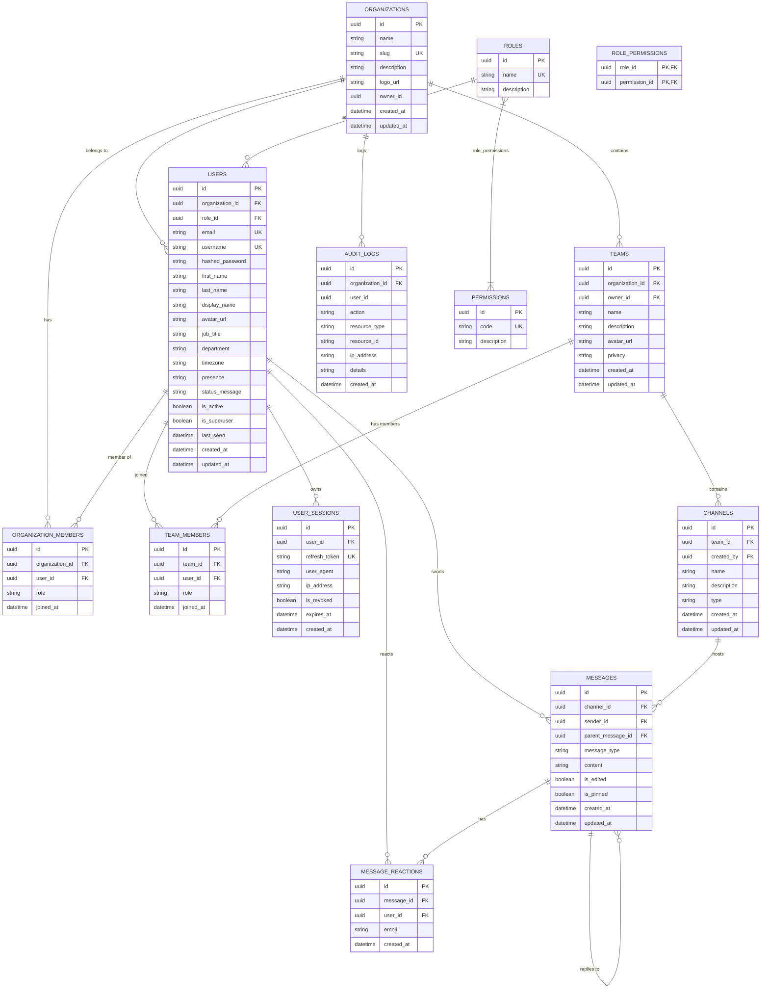

# MicroproTeams — Database Schema & ERD Specification

## Entity Relationship Diagram (ERD)

---

## Key Constraints & Indexes
- **UUID Primary Keys**: Every table uses a 36-character UUID primary key.
- **Foreign Keys**: Cascading deletion (`ondelete="CASCADE"`) configured on child relations.
- **Unique Constraints**:
  - `organizations.slug`
  - `users.email`, `users.username`
  - `roles.name`, `permissions.code`
  - `team_members(team_id, user_id)`
  - `organization_members(organization_id, user_id)`
  - `message_reactions(message_id, user_id, emoji)`
